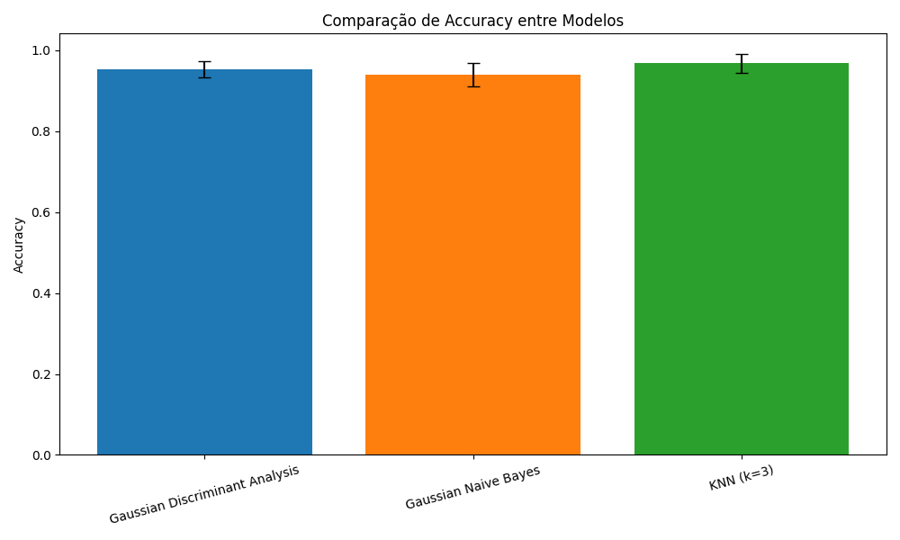
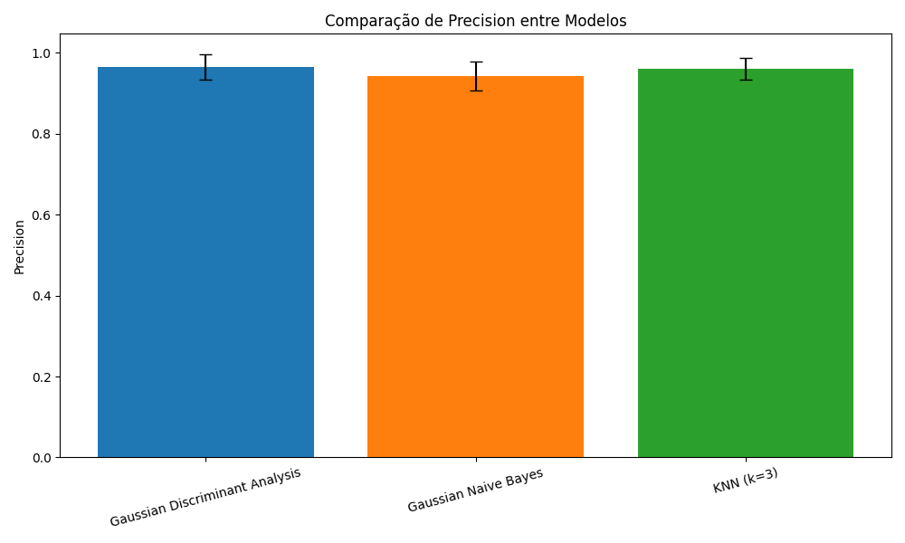
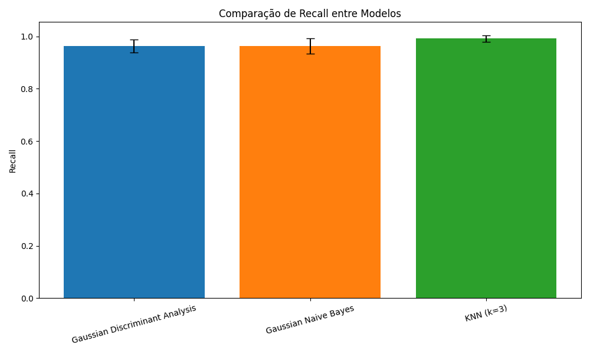
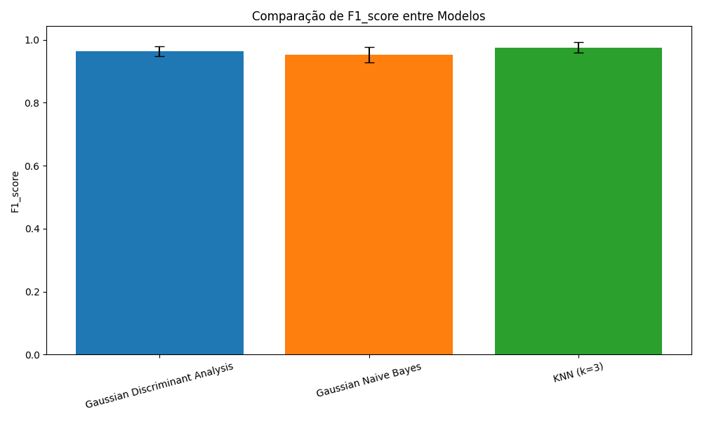

# Lista 4: Classificação Supervisionada  

# **Instituto Federal do Ceará**  
## **Campus Maracanaú**  

**Professor**: Hericson Araújo  
**Disciplina**: Reconhecimento de Padrões  
**Aluno**: Francisco Aldenor Silva Neto  
**Matrícula**: 20221045050117  

---

## Introdução  

Neste trabalho, foi realizada uma análise comparativa de três algoritmos de classificação supervisionada aplicados ao conjunto de dados **Breast Cancer Wisconsin Diagnostic**. Os métodos utilizados foram:  

1. **Gaussian Discriminant Analysis (GDA)**  
2. **Gaussian Naive Bayes (GNB)**  
3. **K-Nearest Neighbors (KNN)**  

O objetivo foi avaliar o desempenho de cada algoritmo com base em métricas como acurácia, precisão, revocação e F1-Score utilizando validação cruzada de 10 folds.  

---  

## Parte Teórica  

### 1. Gaussian Discriminant Analysis (GDA)  

O **GDA** é um classificador baseado na suposição de que as amostras de cada classe seguem uma distribuição normal multivariada. Ele calcula os seguintes parâmetros:  
- **Média**: μ_k  
- **Matriz de covariância**: Σ_k  
- **Probabilidade a priori**: P(C_k)  

A função discriminante para cada classe é dada por:  
**g_k(x) = log(P(C_k)) - (1/2) log(|Σ_k|) - (1/2) (x - μ_k)^T Σ_k^(-1) (x - μ_k)**  

---

### 2. Gaussian Naive Bayes (GNB)  

O **GNB** assume independência condicional entre os atributos, simplificando o cálculo da probabilidade condicional:  
**P(x|C_k) = ∏ (1 / √(2πσ_k,i^2)) exp(-((x_i - μ_k,i)^2 / (2σ_k,i^2)))**  

Essa abordagem reduz a complexidade computacional em relação ao GDA.  

---

### 3. K-Nearest Neighbors (KNN)  

O **KNN** é um método baseado em instâncias que classifica uma amostra com base nas \(k\) amostras mais próximas no espaço de atributos, utilizando uma métrica de distância como a **distância Euclidiana**:  
**d(x, y) = √(∑ (x_i - y_i)^2)**  

A classe mais frequente entre os \(k\) vizinhos é atribuída à amostra.  

---  

## Resultados  

### 1. Acurácia  

#### Tabela de Resultados - Acurácia  

| Modelo                | Média    | Desvio Padrão |  
|-----------------------|----------|---------------|  
| **GDA**              | 0.9536   | 0.0199        |  
| **GNB**              | 0.9393   | 0.0290        |  
| **KNN** (k=3)        | 0.9679   | 0.0237        |  

#### Gráfico - Acurácia  
  

---  

### 2. Precisão  

#### Tabela de Resultados - Precisão  

| Modelo                | Média    | Desvio Padrão |  
|-----------------------|----------|---------------|  
| **GDA**              | 0.9654   | 0.0313        |  
| **GNB**              | 0.9416   | 0.0356        |  
| **KNN** (k=3)        | 0.9597   | 0.0275        |  

#### Gráfico - Precisão  
  

---  

### 3. Revocação  

#### Tabela de Resultados - Revocação  

| Modelo                | Média    | Desvio Padrão |  
|-----------------------|----------|---------------|  
| **GDA**              | 0.9626   | 0.0255        |  
| **GNB**              | 0.9629   | 0.0284        |  
| **KNN** (k=3)        | 0.9920   | 0.0123        |  

#### Gráfico - Revocação  
  

---  

### 4. F1-Score  

#### Tabela de Resultados - F1-Score  

| Modelo                | Média    | Desvio Padrão |  
|-----------------------|----------|---------------|  
| **GDA**              | 0.9634   | 0.0149        |  
| **GNB**              | 0.9516   | 0.0240        |  
| **KNN** (k=3)        | 0.9754   | 0.0176        |  

#### Gráfico - F1-Score  
  

---  

## Discussão  

- **KNN (k=3)** apresentou o melhor desempenho geral, com os maiores valores de acurácia (96,79%) e F1-Score (97,54%). Isso demonstra que a abordagem baseada em vizinhos próximos é bastante eficiente para este conjunto de dados.  
- **GDA** obteve um desempenho competitivo, especialmente na precisão e revocação, com F1-Score de 96,34%.  
- **GNB** apresentou resultados satisfatórios, mas inferiores aos outros métodos. A suposição de independência condicional entre os atributos pode não se ajustar bem aos dados.  

---  

## Conclusão  

O trabalho destacou a importância de diferentes abordagens para problemas de classificação. O KNN, configurado com \(k=3\), apresentou o melhor desempenho, seguido pelo GDA. O GNB, embora mais simples, teve resultados competitivos.

## Repositório
[Repositório no GitHub - Classificação Supervisionada](https://github.com/Aldenor-Neto/Regressao-Logistica)
